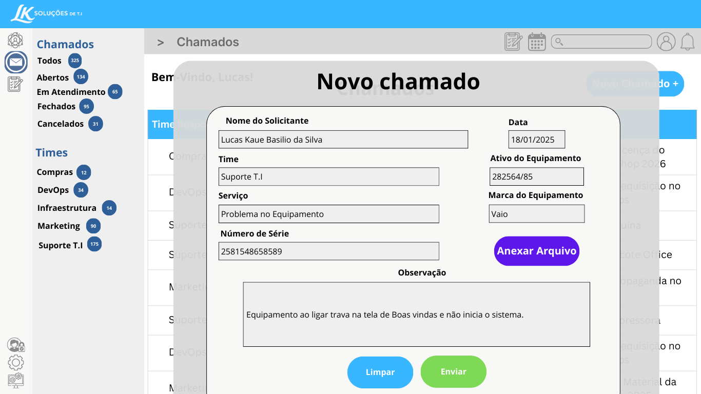

<!-- =========================================================
   LK ServiceDesk - README Premium (Completo)
========================================================= -->

<div align="center">


<p>
  
  
  
  
</p>

<h3>🚀 Sistema de Chamados para simular um Service Desk real</h3>

<p>
  Projeto moderno para portfólio: <b>controle de chamados + SLA automático + dashboard + histórico</b>.  
  Feito para demonstrar skills em <b>front-end</b>, <b>backend</b> e <b>banco de dados</b>.
</p>

<!-- Links rápidos -->
<p>
  <a href="#-visão-geral"></a>
  <a href="#-telas-do-sistema"></a>
  <a href="#-funcionalidades"></a>
  <a href="#-regras-de-sla-acordo-de-nível-de-serviço"></a>
  <a href="#-fluxo-de-status-do-chamado"></a>
  <a href="#-como-rodar-o-projeto"></a>
  <a href="#-api-resumo"></a>
  <a href="#-roadmap"></a>
</p>

</div>

---

## 📌 Visão Geral

O **LK ServiceDesk** é um sistema web de chamados que simula um Service Desk real, com foco em fluxo, rastreabilidade e SLA.

✅ Principais recursos:
- **Login**
- **Dashboard** com indicadores e gráficos
- **Gestão de Chamados** (lista, filtros, criação e detalhe)
- **SLA automático** por prioridade (prazo e alerta de atraso)
- **Histórico/Auditoria** das mudanças
- **Anexos** no chamado
- **Relatórios** (em evolução)

---

## 🖼️ Telas do sistema


<details>
  <summary><b>🔐 Login</b> — e-mail/senha (Google planejado)</summary>
  <br/>
  <ul>
    <li>Login por <b>e-mail/senha</b></li>
    <li>Botão <i>“Fazer login com o Google”</i> (planejado)</li>
  </ul>
  
</details>

<details>
  <summary><b>📊 Dashboard</b> — cards, gráficos e últimas atualizações</summary>
  <br/>
  <ul>
    <li>Cards: <b>Chamados Abertos</b>, <b>Resolvidos</b>, <b>Atrasados (SLA)</b></li>
    <li>Gráfico: “Chamados na Semana”</li>
    <li>Gráfico: “Tipos de Chamados”</li>
    <li>Lista: “Últimas atualizações”</li>
  </ul>
  
</details>

<details>
  <summary><b>🎫 Lista de Chamados</b> — filtros por status e time</summary>
  <br/>
  <ul>
    <li>Filtros por <b>status</b></li>
    <li>Filtros por <b>times</b> (Compras, DevOps, Infra, Marketing, Suporte T.I)</li>
    <li>Tabela: <b>Time</b>, <b>Usuário</b>, <b>Data</b>, <b>Status</b>, <b>Notas</b></li>
    <li>Botão: <b>Novo Chamado +</b></li>
  </ul>
  
</details>

<details>
  <summary><b>➕ Novo Chamado (Modal)</b> — abertura com dados do equipamento e anexo</summary>
  <br/>
  <ul>
    <li>Nome do solicitante</li>
    <li>Time / Serviço</li>
    <li>Número de série / Ativo / Marca</li>
    <li>Data e Observação</li>
    <li>Botão: <b>Anexar Arquivo</b></li>
  </ul>
  
</details>

<details>
  <summary><b>🧾 Detalhe do Chamado</b> — SLA, status e solução</summary>
  <br/>
  <ul>
    <li>Título/Tipo (ex: <b>#Problema no Equipamento</b>)</li>
    <li>Status (ex: Finalizado)</li>
    <li>Badge de SLA + contador de tempo</li>
    <li>Responsável pelo SLA / Anexo / Observação</li>
    <li>Solução do SLA</li>
  </ul>
  
</details>

---

## ✨ Funcionalidades

### ✅ Autenticação
- [ ] Login (e-mail/senha)
- [ ] Logout
- [ ] Login Google (OAuth) *(futuro)*

### ✅ Dashboard
- [ ] Total de chamados por status
- [ ] Chamados vencidos (SLA estourado)
- [ ] Gráfico de chamados na semana
- [ ] Gráfico por tipo/time
- [ ] Últimas atualizações (feed)

### ✅ Chamados (Core)
- [ ] Criar chamado (dados do equipamento + observação)
- [ ] Listar e filtrar por status e por time
- [ ] Visualizar detalhe completo do chamado
- [ ] Atualizar status do chamado
- [ ] Registrar solução/encerramento
- [ ] Anexar arquivo

### ✅ Histórico / Auditoria
- [ ] Registro de eventos (status/prioridade/responsável)
- [ ] Linha do tempo de atualizações do chamado

### ✅ Relatórios
- [ ] Relatórios por time
- [ ] Relatórios por status
- [ ] Exportação (futuro): PDF/Excel

---

## ⏱️ Regras de SLA (Acordo de Nível de Serviço)

O **SLA** define o tempo máximo para um chamado ser atendido/resolvido com base na **prioridade**.  
No **LK ServiceDesk**, o SLA é calculado automaticamente no momento da abertura do chamado.

### ✅ Como o SLA funciona (passo a passo)
- ✅ Ao abrir um chamado → o sistema define automaticamente o prazo: **`due_at`**
- ⏳ Enquanto `agora <= due_at` → chamado está **dentro do SLA**
- 🔥 Se `agora > due_at` → chamado vira **ATRASADO (SLA Vencido)**
- 🎯 Chamados vencidos recebem destaque visual (badge/cor/alerta e aparecem no dashboard)

📌 **Regra principal:**
```txt
Se (agora > due_at) → Chamado = ATRASADO (SLA VENCIDO)

due_at = 19/01/2026 10:00

ABERTO -> EM ATENDIMENTO
EM ATENDIMENTO -> EM ESPERA | RESOLVIDO
EM ESPERA -> EM ATENDIMENTO
RESOLVIDO -> FECHADO
ABERTO | EM ATENDIMENTO | EM ESPERA -> CANCELADO

<div align="center">
⭐ Curtiu o projeto?

Se esse repositório te ajudou, deixa uma ⭐ no GitHub!

</div> ```
